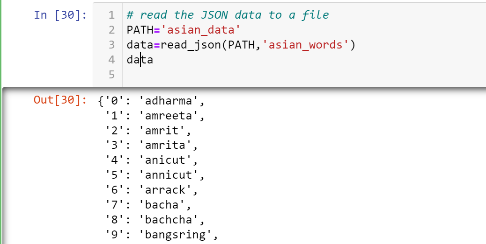
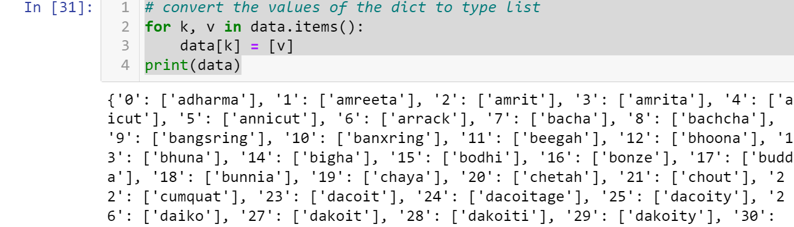
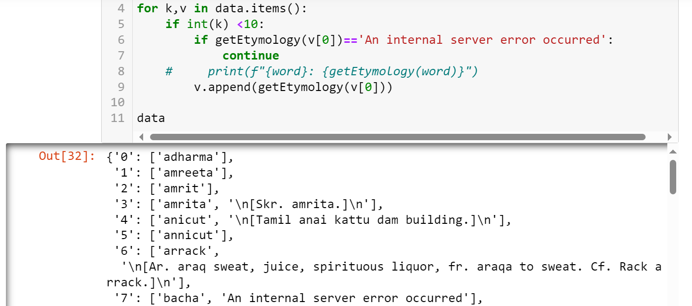

# JSONPlayground
The codebase provides some interactions with .json and .jsonl file formats

# Setup
## Virtual environment
Create a virtual environment using conda <br>
`conda create --name <your virtual environment> python=<your preferred python version>`

Activate the environment
`conda activate <your virtual environment>`

## Module importation
The most important modules to import are **json** and **jsonlines**
-  `import json`
-  `import jsonlines`

The other modules included the project can be imported/installed at leisure. 
Ensure you're within your virtual environment when installing modules. 

# Basic file operations
## Reading a file 
```
with jsonlines.open(f'{PATH}/{file_name}.jsonl') as reader:\n",
    "        for obj in reader:\n",
    "            ...",
```

## Writing to a file
```
with jsonlines.open(f'{PATH}/{file_name}.jsonl', mode='a') as writer:\n",
    "        ...",
```

# Sample project: Working with word etymologies
* Dataset: /asian_data/asian_words.json

* Requirements: A Wordnik API Key.
Visit [Wordnik](https://developer.wordnik.com) to learn more.

* Open *main.ipynb*  and navigate to **Sample project**

* Reading the json file. 
 

* Converting the dict values to type list
 

* Retrieving word etymologies from the API
 

* Append the etymologies to your json file
```
write_to_json(PATH,'asian_words-test',data)
```


